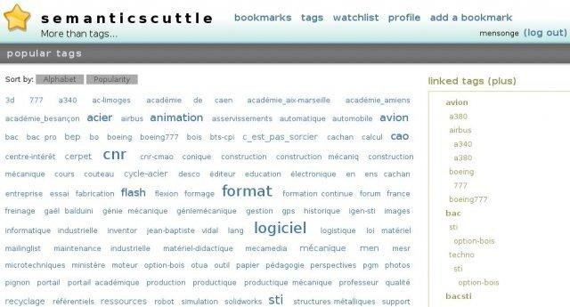

#  SemanticScuttle

SemanticScuttle is a social bookmarking tool experimenting with new features like structured (heirarchical) tags and collaborative descriptions of tags. Originally a fork of Scuttle, it has overtaken its ancestor in stability, features and usability. The querwurzel [fork](https://github.com/querwurzel/semantic-scuttle) brought the software up to PHP 7.3 compatibility, but is no longer in development. This fork's aims are to:
  * bring app compatibility up to PHP 8.2 (for at least the MySQL/mysqli database option, possibly others), avoiding the "Deprecated" messages under PHP 8.2 that will be the "Fatal Error"s of a future PHP version;
  * correct broken links in the documentation; and to
  * bundle a responsive theme (forked from [sscuttlizr](https://github.com/jonrandoem/sscuttlizr)) with minimal features, designed for cases in which this app is embedded in a larger system. 

## Features
  * LDAP/Active Directory authentication
  * RSS feed support: global feed, user feeds, per-tag feeds, private feeds
  * Public and private bookmarks
  * Delicious and Browser bookmark import
  * Theming support
  * Firefox plugin

## Screenshots

## Origin

  * https://sourceforge.net/projects/semanticscuttle/
  * https://github.com/cweiske/SemanticScuttle
  * https://github.com/querwurzel/semantic-scuttle
  * https://github.com/jonrandoem/sscuttlizr
