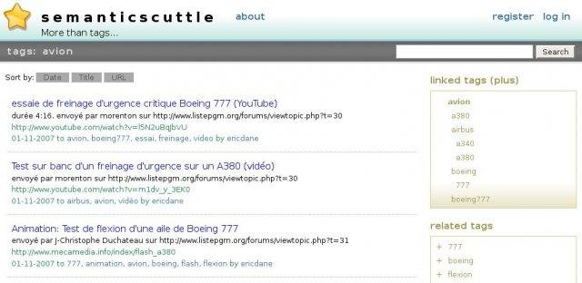

#  SemanticScuttle

SemanticScuttle is a social bookmarking tool experimenting with new features like structured (hierarchical) tags and collaborative descriptions of tags. Originally a fork of Scuttle, it has overtaken its ancestor in stability, features and usability. The querwurzel [fork](https://github.com/querwurzel/semantic-scuttle) brought the software up to PHP 7.3 compatibility, but is no longer in development. This fork's aims are to:
  * bring app compatibility up to PHP 8.2 (for at least the MySQL/mysqli database option, possibly others), avoiding the "Deprecated" messages under PHP 8.2 that will be the "Fatal Error"s of a future PHP version;
  * correct broken links in the documentation; and to
  * bundle a responsive theme (forked from [sscuttlizr](https://github.com/jonrandoem/sscuttlizr)) with minimal features, designed for cases in which this app is embedded as an iframe element.

## Warning

Although a visual code review leads to the conclusion that due attention has been paid to application security by previous developers, we offer no warranty, express or implied, regarding the security of this application. Many of the risks associated insecure application code may be mitigated by turning off anonymous editing and user registration capabilities after a single administrative user has been created (see configuration.rst file in doc folder), giving the application read-only access to the database after setup and data loading is complete, and/or not exposing the application to the internet. 

## Features
  * LDAP/Active Directory authentication
  * RSS feed support: global feed, user feeds, per-tag feeds, private feeds
  * Public and private bookmarks
  * Delicious and Browser bookmark import
  * Theming support
  * Firefox plugin

## Screenshots

## Origin

  * https://sourceforge.net/projects/semanticscuttle/
  * https://github.com/cweiske/SemanticScuttle
  * https://github.com/querwurzel/semantic-scuttle
  * https://github.com/jonrandoem/sscuttlizr

## Additional credit
*Higher-resolution gold star icon courtesy of [FreePNGimg.com]([https://github.com/jonrandoem/sscuttlizr](https://freepngimg.com/png/607-gold-star-png-image)  
